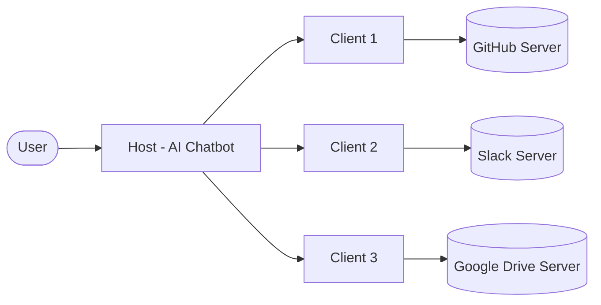
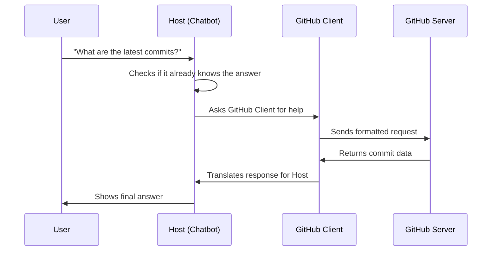
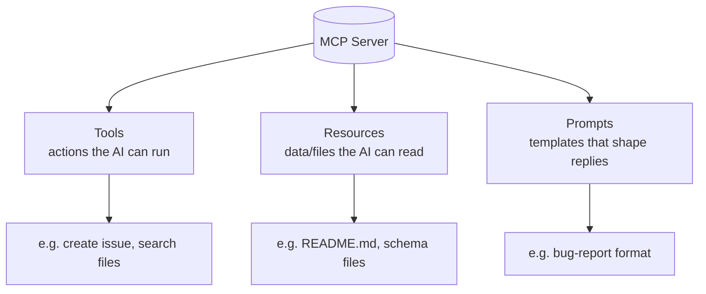
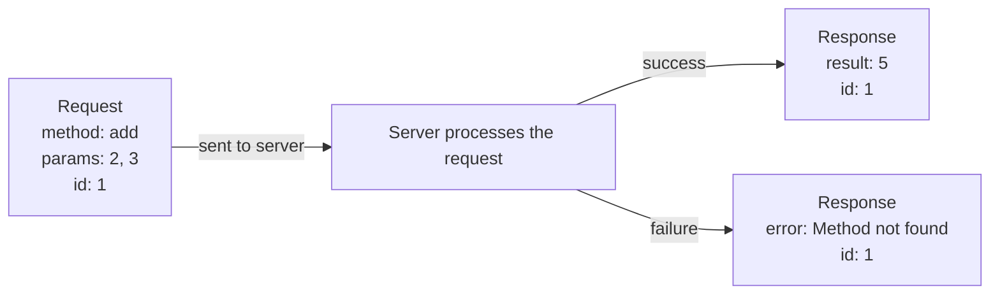
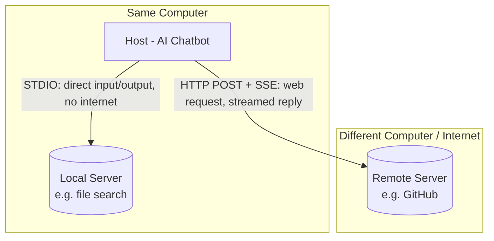

# Understanding MCP (Model Context Protocol)

A simple guide to how an AI chatbot talks to outside tools and services.

---

## 1. What is MCP?

MCP is a standard way for an AI chatbot (called the **Host**) to connect with outside services like GitHub, Slack, or Google Drive (called **Servers**), so the AI can actually *do* things, not just talk.

Think of it like a universal plug. Instead of every AI app needing a custom wire for every service, MCP gives everyone the same plug shape, so anything can connect to anything.



---

## 2. The Three Main Parts

| Part | What it is | Simple analogy |
|------|-----------|-----------------|
| **Host** | The AI chatbot you talk to | Your phone |
| **Client** | A go-between that connects the host to one specific server | The SIM card inside your phone |
| **Server** | The outside service that actually does the task | The network provider (like Airtel or Jio) |

Important rule: the Host never talks to a Server directly. It always goes through a Client. Each Client connects to exactly one Server. If the Host needs to talk to GitHub *and* Slack, it uses two separate Clients, one for each.

### How a request flows (example)

Say you ask the chatbot: *"What are the latest commits on my GitHub repo?"*

1. You type your question to the Host (the chatbot).
2. The Host realizes it does not know this information on its own.
3. The Host asks its GitHub Client for help.
4. The GitHub Client converts your question into a format the GitHub Server understands.
5. The GitHub Server processes it and sends back the answer.
6. The Client translates that answer back into something the Host can use.
7. The Host shows you the final answer.

This separation keeps things organized: each Client only worries about its own Server, and multiple Clients can work at the same time without getting in each other's way.



---

## 3. What Can a Server Offer? (Primitives)

A Server can give the Host three kinds of things, called **primitives**:

- **Tools** – Actions the AI can perform, like "create a GitHub issue" or "search files in Google Drive."
- **Resources** – Information the AI can read, like a README file or a document.
- **Prompts** – Ready-made templates that tell the AI how to format its response.



### Why prompts matter (example)

If you ask an AI to "create an issue for the bug: login button doesn't work," it might write something messy or incomplete.

But if the Server provides a **prompt template** that says "every bug report must include a title, description, steps to reproduce, expected behavior, and actual behavior," the AI will follow that structure automatically. This keeps the output consistent and professional every time.

---

## 4. How Do These Parts Talk to Each Other? (Data Layer)

MCP uses a messaging format called **JSON-RPC 2.0**. Don't worry about the name — it just means messages are sent as small, structured pieces of text that both sides can understand.

Every message has a simple shape:

**A request looks like this:**
```json
{
  "jsonrpc": "2.0",
  "method": "add",
  "params": [2, 3],
  "id": 1
}
```
This is basically saying: "Please run the function called `add` with the numbers 2 and 3, and call this request #1."

**A successful response looks like this:**
```json
{
  "jsonrpc": "2.0",
  "result": 5,
  "id": 1
}
```
This says: "Here's the answer to request #1 — it's 5."

**If something goes wrong, the response looks like this:**
```json
{
  "jsonrpc": "2.0",
  "error": {
    "code": -32601,
    "message": "Method not found"
  },
  "id": 1
}
```
This says: "Request #1 failed because that function doesn't exist."



### Standard operations

Each type of primitive has its own set of standard requests:

- **Tools:** `tools/list` (see what tools are available), `tools/call` (use a tool)
- **Resources:** `resources/list` (see what's available), `resources/read` (open one), plus `subscribe`/`unsubscribe` for live updates
- **Prompts:** `prompt/list` (see available templates), `prompt/get` (fetch one)

### A few extra abilities of JSON-RPC

- **Batching** – Send several requests together at once instead of one by one.
- **Notifications** – Quick "fire and forget" messages that don't need a reply, useful for alerts or updates.
- **Two-way communication** – Usually the Client asks the Server for things, but the Server can also reach out to the Client when something changes.

---

## 5. How Do Messages Actually Travel? (Transport Layer)

JSON-RPC defines *what* the messages look like. The transport layer defines *how* they physically get from one place to another. MCP supports two methods, depending on where the Server lives.



### A. Same computer — STDIO (Standard Input/Output)

If the Server runs on the same machine as the Host, they communicate using STDIO. In simple terms, the Host starts the Server as a small background program, and they exchange messages by writing to and reading from each other directly — no internet needed.

**Why this is useful:**
- Very fast, since there is no network involved
- Secure, because nothing is exposed to the outside world
- Easy to set up

**Example:** A file-search Server running on your laptop lets the chatbot look through your folders and find files, using STDIO to communicate.

### B. Different computers — HTTP + SSE (Server-Sent Events)

If the Server is somewhere else on the internet, the Host sends regular HTTP requests (the same kind your browser sends) to reach it. SSE allows the Server to stream back multiple pieces of a response over time, which is great for tasks that take a while.

**Why this is useful:**
- Works over the internet, from anywhere
- Supports normal login/authentication methods
- Good for long or step-by-step responses

**Example:** A remote GitHub Server can be reached over HTTP+SSE to fetch your starred repositories or open issues, even though it's running on a completely different machine.

---

## 6. Why Was MCP Designed This Way?

- **Modular** – Each Client only needs to know about its own Server. The Host stays simple.
- **Scalable** – Adding a new service just means adding a new Client, with no changes to the Host itself.
- **Parallel-friendly** – Multiple Clients can talk to their Servers at the same time.
- **Lightweight** – JSON-RPC has less overhead than typical web APIs (REST), making messages smaller and simpler.
- **Flexible** – The same message format (JSON-RPC) works whether the Server is local (STDIO) or remote (HTTP+SSE), so the system can adapt to new transport methods later without redesigning everything.
- **Two-way ready** – Servers can notify Clients of changes, enabling real-time updates and subscriptions.

### Why JSON-RPC instead of REST?

1. Lighter — less extra information packed into each message
2. Supports two-way communication, not just request-and-reply
3. Works with any transport method
4. Allows sending multiple requests in one batch
5. Supports "fire and forget" notifications, which REST does not handle naturally

---

## 7. Quick Recap

- **Host** = the chatbot you interact with
- **Client** = the connector between the Host and one Server
- **Server** = the outside service doing the actual work
- **Primitives** (Tools, Resources, Prompts) = what a Server can offer
- **JSON-RPC** = the message format everyone agrees on
- **STDIO** = transport for local Servers (same machine)
- **HTTP + SSE** = transport for remote Servers (over the internet)

MCP's whole design is about keeping things simple, consistent, and easy to extend — one common language and connection method that any AI Host and any Server can use together.
